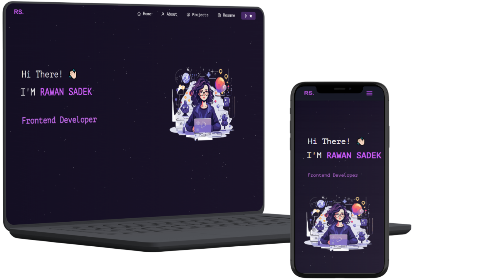

<h2 align="center">
  Portfolio Website - v1.0 
  <a href="https://portfolio-rawan-sadek.vercel.app/" target="_blank">RawanSadek</a>
</h2>

  

## 👩🏻‍💻 Rawan Sadek – Portfolio

This is my personal frontend portfolio website, built to showcase my projects, skills, and experience as a React.js developer.  
The website highlights my technical expertise, professional background, and the frontend applications I’ve developed individually and in teams. 

## 🚀 Live Demo
🔗 <a href='https://portfolio-rawan-sadek.vercel.app/' target="_blank">View Portfolio</a>↗

## 🛠️ Tech Stack

This project was built using these technologies.

- React.js
- Node.js
- Express.js
- CSS3
- VsCode
- Vercel

## 💡 Features

  **📖 Multi-Page Layout**

  **🎨 Styled with React-Bootstrap and Css with easy to customize colors**

  **📱 Fully Responsive**

## ⚙️ Getting Started

Clone down this repository. You will need `node.js` and `git` installed globally on your machine.

## 🛠 Installation and Setup Instructions

1. Installation: `npm install`

2. In the project directory, you can run: `npm start`
    Runs the app in the development mode.\
    Open [http://localhost:3000](http://localhost:3000) to view it in the browser.

### 🖋️ Credits

This portfolio is based on the open-source React template by <a href='https://github.com/soumyajit4419/Portfolio.git'>Soumyajit Behera<a/>
